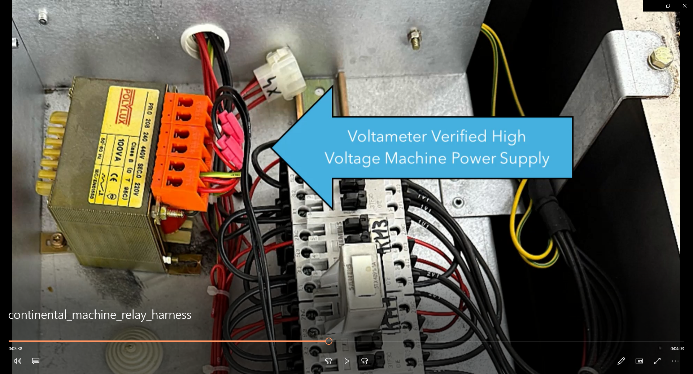

# Continental

Access installation manuals, programming guides, harness documentation, and training resources for Continental machines.

---

### Harness Manuals

Select a manual below to view or download the PDF. *(Note: Installation uses scotch locks for connections).*

* [Continental Relay Harness Manual](PDF/continental-relay-manual.pdf)

---

### Video Tutorials

    
<strong>Continental Relay Harness Setup</strong>

    

---

