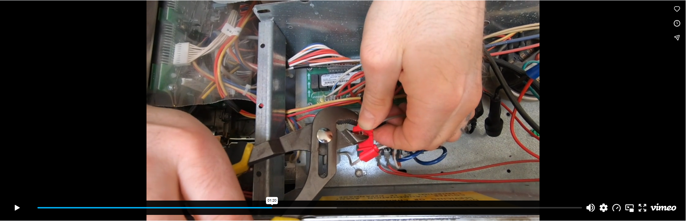
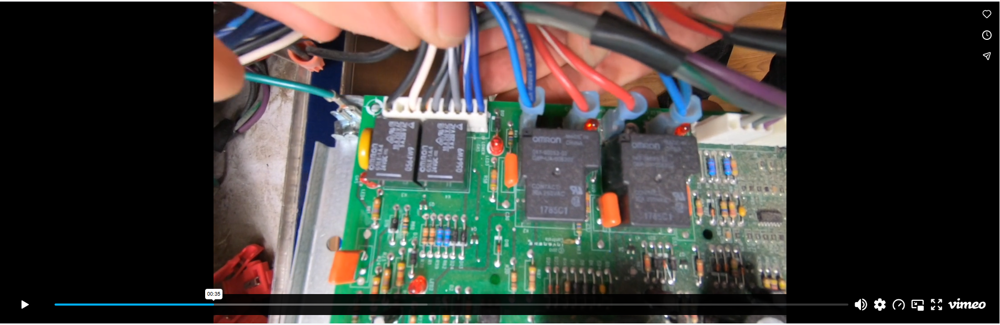
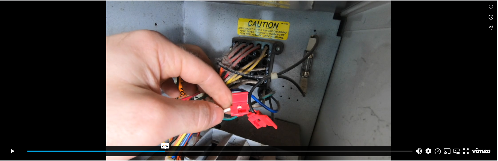

# Dexter

Access installation manuals, programming guides, harness documentation, and training resources for Dexter machines.

---

### Harness Manuals

Select a manual below to view or download the PDF. *(Note: Installation uses scotch locks for connections).*

* [Dexter C-Series K31 Manual](PDF/dexter-k31-cseries-manual.pdf)
* [Dexter DCS020ND K31 Manual](PDF/dexter-k31-dcs020nd-manual.pdf)
* [Dexter Relay Manual](PDF/dexter-relay-manual.pdf)

---

### Video Tutorials

    
<strong>Laundry Install: Relay Harness - Dexter Washer</strong>

    

    
<strong>Laundry Install: Relay Harness - Dexter Stack Dryer</strong>

    

    
<strong>Laundry Install: Relay Harness - Dexter Dryer</strong>

    

---