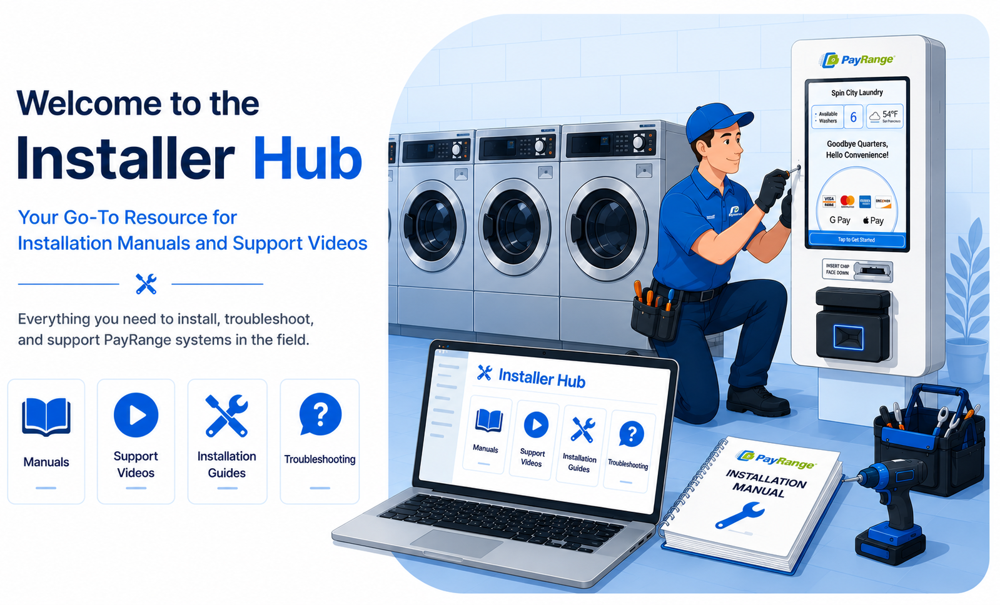

<left>

---

## Welcome

The **Installer Hub** is the central knowledge base for PayRange field installers. Access installation manuals, programming references, troubleshooting guides, and support videos for every supported machine platform.

---

## Quick Start

New to an installation?

1. Browse the **Machine Library** below.
2. Select the machine manufacturer.
3. Open the installation manual.
4. Watch the corresponding support video (when available).

---

## Machine Library

Browse installation guides, programming instructions, and support resources by manufacturer.

| Manufacturer | Resources |
|:-------------|:---------:|
| **Speed Queen & Alliance** | [Open Library](speed-queen.md) |
| **Maytag & Whirlpool** | [Open Library](maytag.md) |
| **LG Commercial** | [Open Library](lg-commercial.md) |
| **Dexter** | [Open Library](dexter.md) |
| **Continental** | [Open Library](continental.md) |
| **IPSO** | [Open Library](ipso.md) |
| **Wascomat & LaundryLux** | [Open Library](wascomat.md) |

---

> **Tip:**
> Looking for a specific machine or manual? Use the **search bar** at the top of the page to instantly locate manuals, videos, programming guides, and troubleshooting information.
