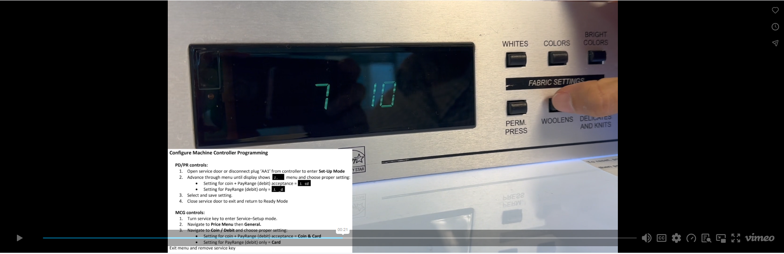
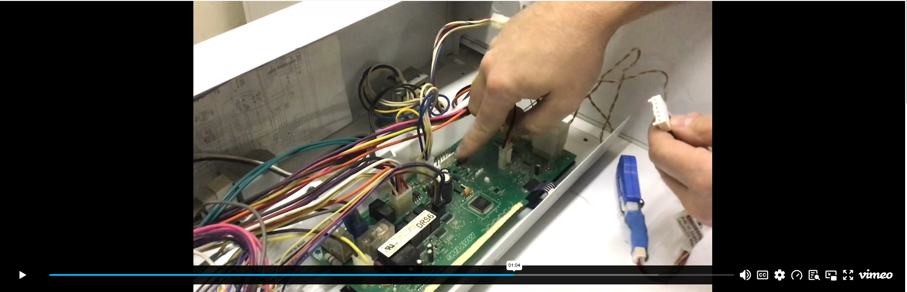

# Maytag & Whirlpool

Access installation manuals, programming guides, harness documentation, and training resources for Maytag and Whirlpool equipment.

### Harness Manuals

Select a manual below to view or download the PDF. *(Note: Installation uses scotch locks rather than splicing for connections).*

* [Maytag C3 Harness Manual](PDF/maytag-c3-manual.pdf)
* [Maytag C23 Harness Manual](PDF/maytag-c23-manual.pdf)

---

### Programming & Reference Guides

* [Maytag Programming Guide PDF](PDF/maytag-programming.pdf)

---

### Video Tutorials

    
<strong>Maytag Machine Programming</strong>

    

    
<strong>Laundry Install: Maytag (C3 Harness)</strong>

    

---