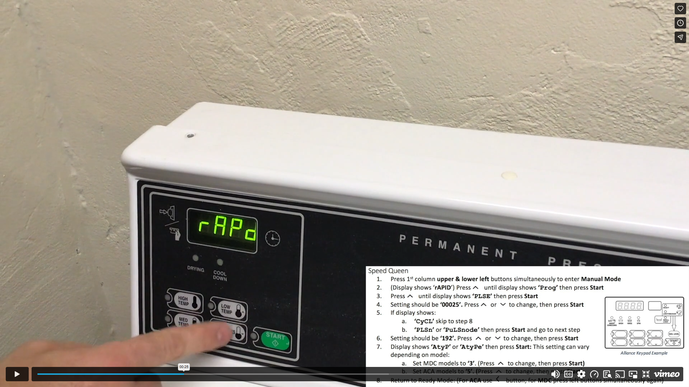
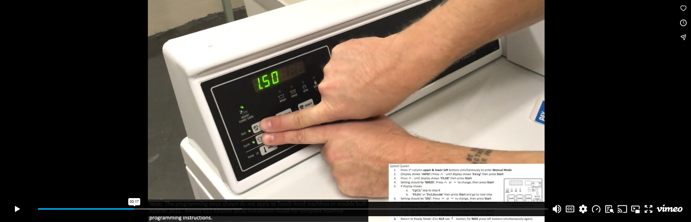
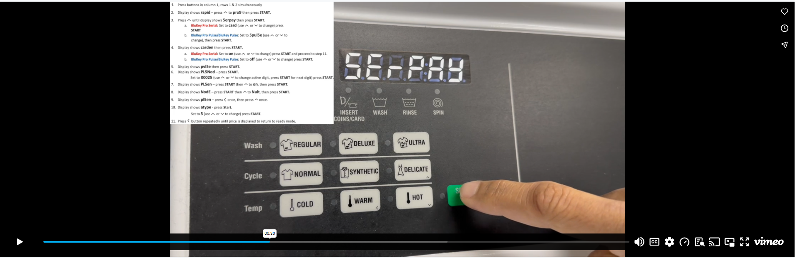
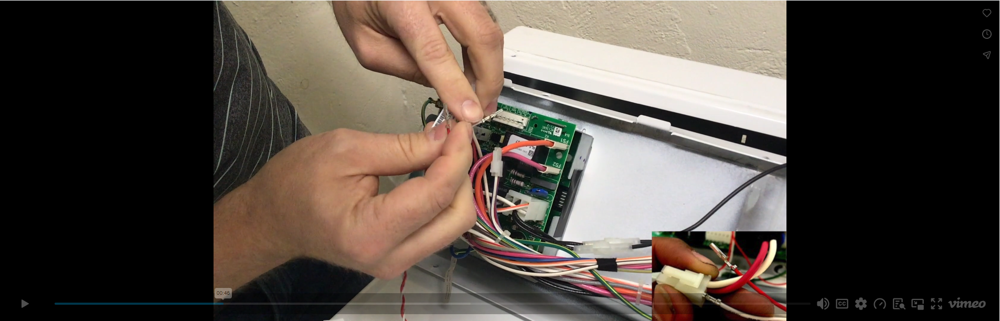
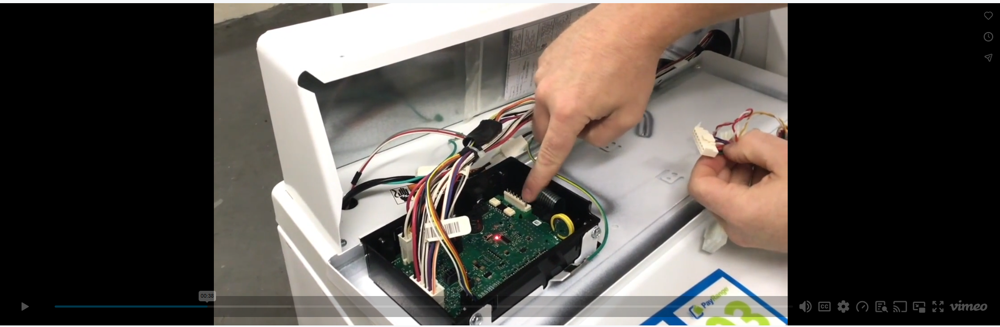

# Speed Queen & Alliance

Access installation manuals, programming guides, harness documentation, and training resources for Speed Queen and Alliance equipment.

### Programming & Reference Guides

* [Speed Queen Programming Guide PDF](PDF/sq-programming.pdf)

---

### Harness Manuals

* [Speed Queen C1 Harness Manual](PDF/sq-c1-manual.pdf)
* [Speed Queen C2 Harness Manual](PDF/sq-c2-manual.pdf)
* [Speed Queen C18 Harness Manual](PDF/sq-c18-manual.pdf)

---

### Video Tutorials

    
<strong>MDC Controller Machine Programming</strong>

    

    
<strong>ACA Controller Machine Programming Pre 2021</strong>

    

    
<strong>ACA Controller Machine Programming Post 2021</strong>

    

    
<strong>Laundry Install: Speed Queen with MDC Controller (C1 Harness)</strong>

    

    
<strong>Laundry Install - Speed Queen with ACA Controller (C2 Harness)</strong>

    

---

